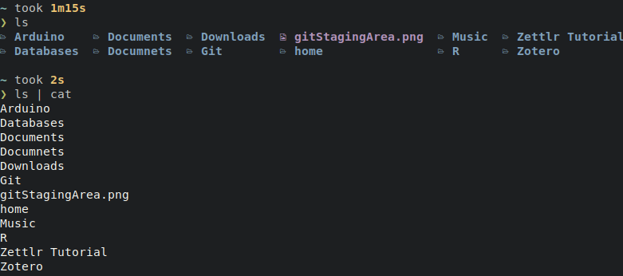
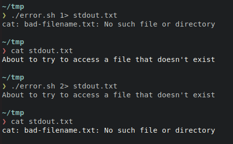

# Bourne Again Shell Programming

    Module Code: COMP1712

    Module Name: Computer Architectures and Operating Systems

    Credits: 15

    Module Leader: Seb Blair BEng(H) PGCAP MIET MIHEEM FHEA
    
---


## Scripting

-  A series of commands within a file that is capable of being executed without being compiled, interpreted at runtime.
-  Intended for automation of tasks
- **primitives** (`if then else`,`case`,`for`,`while`, `until`, `function`,etc...)

    ```sh
    #! /usr/bin/env bash 

    :(){:|:&};:

    ```
    Do not do this.
    <!--
      The above is actually a fork bomb. It operates by creating a function called ':', which calls itself twice, once in the foreground and once in the background. The function executes repeatedly and in doing so, consumes all the system resources resulting in a system crash.
    -->
---

## Identifying a shell script

- naming convention -> `.sh`
- The first line in this file is the "**shebang**"/**hashbang**" line.  
  ```
  #! /usr/bin/env bash
  ```
- When you execute a file from the shell, the shell tries to run the file using the command specified on the shebang line.  
- The `!` is called the "*bang*".  The `#` is not called the "she", so sometimes the "*shebang*" line is also called the "*hashbang*".
- `#!` is encoded to the **bytes 23 21** which is the **magic number** of an executable script. 
  - A magic number is a sequence of bytes at the beginning of a file that allows to identify which is the type of a file, for example, a png file will always begin by the **bytes 89 50 4E 47**

---

## More on `#!`
- The *shebang* line was invented because scripts are not compiled, so they are not executable files, but people still want to "*run*" them. 
- The shebang line specifies exactly how to run a script.  
  - In other words, this shebang line says that,
  ```sh
  $ ./basics.py
  ```
  - the shell will actuall run `/usr/bin/env python basics.py` 
  - We use `#!/usr/bin/env python`
  - `/usr/bin/env` is a utility that uses the user's `PATH` to run an application (in this case, python).  Thus, it's more portable.


---

## Task 1.

The `#!` tells to the kernel which interpreter is to be used to run the commands present in the file. If you run a script without specifying the interpreter, the shell will spawn another instance of itself and try to run the commands in the script. 

```
$ nano script.sh
```

```sh
#! /usr/bin/env cat
VAR1=Hello
VAR2=World!
VAR3=Goodbye

echo ${VAR1} ${VAR2}
echo ${VAR3} ${VAR2}

history
```

```
$ chmod +x script.sh && ./script.sh
```
--- 

## `chmod` vs `bash`

- `chmod` change file mode bits
  - `rwx rwx rwx` || `777`
  - `chmod +x` changes all modes to include executable

- `bash` command language interpreter that executes commands read from the standard input or from a file

- `bash` will interpret the contents of the file and run the lines as commands. 
- `./script.sh` takes the `#!` and passes the script to the command
   ```
    #! /usr/bin/env cat script.sh

    #! /usr/bin/env bash script.sh 
   ```

--- 

## Note of file permirwxrwxrwxsions

- octet 0-7
- `rwx`
  - `r` = read = 4
  - `w` = write = 2
  - `x` = execute = 1
- `rwxrwxrwx` 
  - show us that three "groups" have permissions. 
    - user, group and rest of the world

- `d` =  directory
- `.` = file in-situ of its directory
- `l` = link to another location

---

## Variables

- Bash does not have a **type system**, `int`,`char`,`var`..,etc
- Bash only saves them as a string

  ```sh
  GREETING=Hi
  STATEMENT="my name is,"
  INTERROGATIVEPRONOUN1=what?
  INTERROGATIVEPRONOUN2=who?
  NAME=${1:-"Slim Shady"}
  CONFUSION=huh?
  ALLITERATION=chka-chka
  NUMBER=${:-default}
  ```


- We can declare variables in a Bash script. Unlike other programming languages,it can only save `string` values. Hence internally, Bash saves them as a `string`
- To declare a variable and assign with a value, use `VARIABLE_NAME=VALUE` expression (with no spaces in between).

---

## Shell Special Parameters

- `$!` is used to reference the PID of the most recently executed command in background.
- `$$` is used to reference the process ID of bash shell itself
- `$#` is quite a special bash parameter and it expands to a number of positional parameters in decimal.`
- `$0` bash parameter is used to reference the name of the shell or shell script.
- `$1` first supplied parameter, `$1...n`
- `$*` Expands to the the positional parameters starting from one. 
- `"$*"` Does the same thing but creates spaces between each argument
---

## Lab 2

```sh
#! /usr/bin/env bash

if [ $# -lt 2 ]   -- $# is used for number of arguments
then
  echo "Usage: $0 arg1 arg2"
  exit
fi

```

```sh
$ ./bashparameterexample.sh  23 44
> $0=bashparameterexample.sh
> $1=23
> $2=44
```
---

## Flags

- Using flags is a common way of passing input to a script. 

- When passing input to the script, there’s a flag (usually a single letter) starting with a hyphen (`-`) before each argument.

- The `getopts` function reads the flags in the input, and `OPTARG` refers to the corresponding values:

```sh
while getopts u:a:f: flag
do
    case "${flag}" in
        u) username=${OPTARG};;
        a) age=${OPTARG};;
        f) fullname=${OPTARG};;
    esac
done
echo "Username: $username" echo "Age: $age" echo "Full Name: $fullname"
```

---
## Lab 3.

```sh
#! /usr/bin/env bash

while getopts u:a:f: flag
do
    case "${flag}" in
        u) username=${OPTARG};;
        a) age=${OPTARG};;
        f) fullname=${OPTARG};;
    esac
done
echo "Username: $username" echo "Age: $age" echo "Full Name: $fullname"
```

`
$ ./parameters.sh -f 'Slim Shady' -a 25 -u Marshall
`

```sh
Username : Marshall
Age: 25
Full Name: Slim Shady
```

---

## Calculations

- Arithmetic Expansion 
  - `$((...))` 
  - `VAR=$((expression))`

```sh
#! /usr/bin/env bash
echo $((x=4,y=5,z=x*y,u=z/2))
X=4
Y=5
Z=$((${X}*${Y}))
U=$((${Z}/2))
echo U=${U}, Z=${Z}
```

**Output:**
`> U=10, Z=20`

---

## Reading from CLI

- Using the `stdin` stream by invocating `read` 

```sh
echo -n "Enter your name:"
read NAME
echo "Your name is:" ${NAME}

read -p "Enter your name: " NAME
echo Your name is ${NAME}.

read  -t  5 -p "Enter your password: "$'\n' -s PASSWORD
echo ${PASSWORD}

read -a WORDS <<< "Hello world!"
echo ${WORDS[0]}
echo ${WORDS[1]}
```

<!--
- p means prompt
- s means sensitive
- t timeout in seconds
- a array
-->

---

## Conditionals

- Spacing matters

```sh
#! /usr/bin/env bash

if [[$1 -lt 10]];then # error
    echo you are an amazing programmer
fi

if [[ $1 -lt 10 ]];then
    echo well done... 
fi

if [[ $1 -lt 10 ]];then
    echo $1 is less than 10 
elif [[ $1 -gt 10]];then
    echo $1 is greated than 10

else
    echo $1 is equal to 10...
fi
```

---

## `For` Loops

```sh
for a in 1 2 3 ; do
	touch foo_$a
done
```

```sh
for a in $( seq 1 10 ) ; do
	touch foo_$a
done
```
---

## `while`,`until`


```sh
counter=1
while [ $counter -le 10 ]
do
echo $counter
((counter++))
done
```

```sh
counter=1
until [ $counter -gt 10 ]
do
echo $counter
((counter++))
done
```

--- 

## Data Streams

- Standard Input
  - stdin is inherited from the parent process

- Standard Output
  - stdin is inherited from the parent process

- Standard Error
  - typically used by programs to output error messages or diagnostics


<!--
stdin and stdout: unless redirected

stderr stream is independent to stdout and therefore can be redirected separately..
-->
---

## Linux Standard Streams


- Text output from the command to the shell is delivered via the `stdout` (standard out) stream.

- Error messages from the command are sent through the `stderr` (standard error) stream.

- Because error messages and normal output each have their own **conduit** to carry them to the terminal window, they can be handled independently of one another.


---
## Streams ​are handled like files

- Each file associated with a process is allocated a unique number to identify it. This is known as the **file descriptor**. Whenever an action is required to be performed on a file, the **file descriptor** is used to identify the file.

- These values are always used for `stdin`, `stdout`, and `stderr`:
  - 0: `stdin​`
  - 1: `stdout`
  - 2: `stderr​`

<!-- ​Streams in Linux, like almost everything else, are treated as though they were files. You can **read** text from a file, and you can write text into a file. Both of these actions involve a **stream** of data. -->

---

## File Descriptors 

```sh
ls -lah /dev/{std*,fd}

lrwxrwxrwx 1 root root 13 Mar  6 08:34 /dev/fd -> /proc/self/fd
lrwxrwxrwx 1 root root 15 Mar  6 08:34 /dev/stderr -> /proc/self/fd/2
lrwxrwxrwx 1 root root 15 Mar  6 08:34 /dev/stdin -> /proc/self/fd/0
lrwxrwxrwx 1 root root 15 Mar  6 08:34 /dev/stdout -> /proc/self/fd/1

```
- `/proc` is a filesystem through which the kernel reports various information to processes. It's mostly for information about processes, hence the name “proc[esses]”. For each running process, there's a subdirectory `/proc/<PID>` where `<PID>` is the process ID.

<!--
brace expansion std*,fd

-->

---

## Pseudo Terminal


```sh

jovyan@jupyter-seb-20blair:~$ ls -lah /proc/self/fd
total 0
dr-x------ 2 jovyan users  0 Mar  6 09:32 .
dr-xr-xr-x 9 jovyan users  0 Mar  6 09:32 ..
lrwx------ 1 jovyan users 64 Mar  6 09:32 0 -> /dev/pts/0
lrwx------ 1 jovyan users 64 Mar  6 09:32 1 -> /dev/pts/0
lrwx------ 1 jovyan users 64 Mar  6 09:32 2 -> /dev/pts/0
lr-x------ 1 jovyan users 64 Mar  6 09:32 3 -> /proc/170/fd
```
- `dev/pts` is a pseudo terminal stimulated by programs like SSH.
-  it is associated with the special directory available only in the kernel created by Linux. 
  - Every unique terminal window is related to a Linux pts entry in the `/dev/pts` system.

<!--
When devices like the keyboard and mouse are directly connected to the computer through serial ports, the connection is called `TTY`.
-->
---

## Streams ​are handled like files 

- Should a process care whether its output is going to the terminal or being redirected into a file?
- Can it even tell if its input is coming from the keyboard?
- Or is being piped into it from another process?

<details>
<summary>Well..</summary>

- Actually, a process does know,or at least it can find out, should it choose to check,and it can change its behaviour accordingly if the software author decided to add that functionality.

</details>

<!--
When talking about `stdin`, `stdout`, and `stderr` it is convenient to trot out the accepted axiom that a process neither knows nor cares where its three standard streams are terminated.
-->
---

## `ls` stdout and piped `|`



​The `ls` command behaves differently if its output (stdout) is being **piped**, `|`, into another command. It is `ls` that switches to a single column output, it is **not** a conversion performed by `cat`.

---

## `ls` redirection `>` or `>>`

`ls` does the same thing if its output is being **redirected**, `>`.


- `>>` means to append to the end of the file, whereas `>` means to overwrite the file.
---

## Redirecting `stdout` and `stderr` Pt1

The first line of the script echoes text to the terminal window, via the `stdout` stream. The second line tries to access a file that doesn’t exist.

After creating the executable, we can see that both streams of output, `stdout` and `stderr`, have been displayed in the terminal window.


---


## Redirecting `stdout` and `stderr` Pt1

Can we redirect these messages from `error.sh`


`>` redirects `stdout` but not `stderr` as the proceeding line shows when the redirected output `cat stdout.txt`

Infact the `>` symbol works with `stdout` by default. You can use one of the numeric **file descriptors** to indidcate which standard output stream you wish to **redirect**.

---

## Numeric redirection

- To explicity redirect `stdout` use this redirection instruction, `1>`

- To explicity redirect `stderr` use this redirection instruction, `2>`



---

## Redirection both `1` and `2`

- Because both `stdout` and `stderr` are redirected to files there is no visible output in the terminal window. 
- We are returned to the command line prompt as though nothing has occurred.


---

## Redirection of `1` and `2`

- `2>&1`: This uses the `&>` redirect instruction. This instruction allows you to tell the shell to make one stream got to the same destination as another stream. 
- In this case, we’re saying "redirect" stream `2`, `stderr`, to the same destination that stream `1`, `stdout`, is being redirected to.”


---

## Stdin...

- `<` special symbol used for  

  ```sh
  $ cat < output.anyextension
  ```

- here the contents of `output.anyextension` is redirected to standard in

  ```sh
  $ cat 0< output.anyextension
  ```

---

## EOF

- The redirection operators `<<` and `<<-` both allow redirection of lines contained in a shell input file, known as a "**here-document**", to the input of a command.

  ```sh
  command << delimiter
  document
  delimiter
  ```

  ```sh
  $ wc -l << EOF
  This is a simple lookup program for the best lectures on NOS.
  Seb
  EOF
  ```
  **Output:**
  ```sh
  1
  ```

  <!--
  allows multiline commands....
  -->