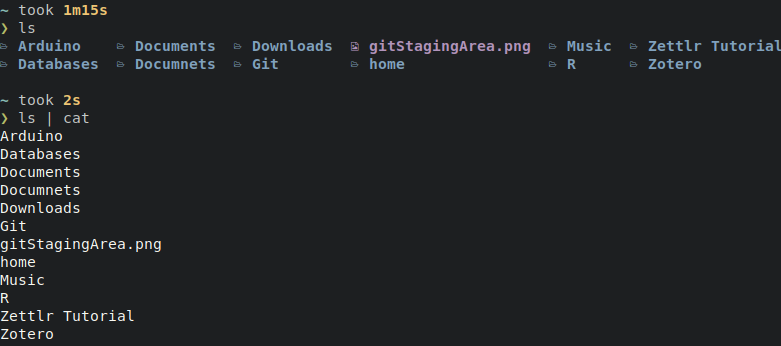
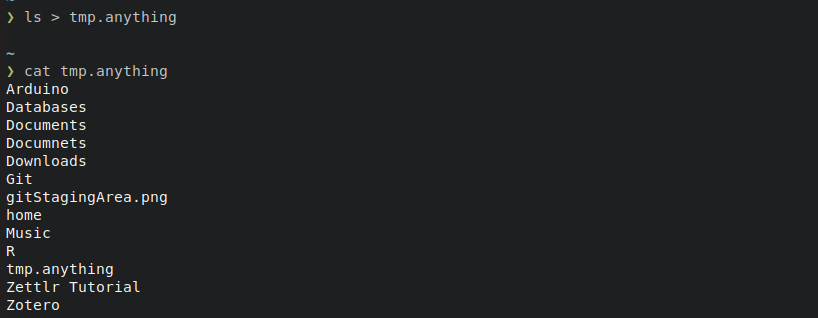
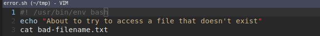
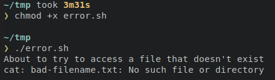
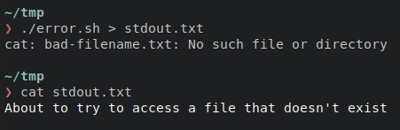
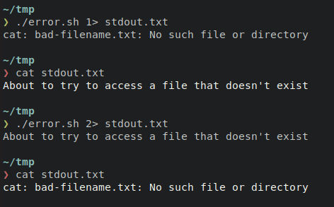
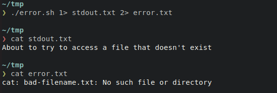
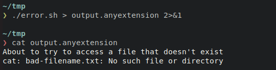

# Data Streams

    Module Code: COMP1712

    Module Name: Computer Architectures and Operating Systems

    Credits: 15

    Module Leader: Seb Blair BEng(H) PGCAP MIET MIHEEM FHEA

---

## Data Streams

- Standard Input
  - stdin is inherited from the parent process

- Standard Output
  - stdin is inherited from the parent process

- Standard Error
  - typically used by programs to output error messages or diagnostics


<!--
stdin and stdout: unless redirected

stderr stream is independent to stdout and therefore can be redirected separately..
-->
---

## Linux Standard Streams


- Text output from the command to the shell is delivered via the `stdout` (standard out) stream.

- Error messages from the command are sent through the `stderr` (standard error) stream.

- Because error messages and normal output each have their own **conduit** to carry them to the terminal window, they can be handled independently of one another.


---
## Streams ​are handled like files

- Each file associated with a process is allocated a unique number to identify it. This is known as the **file descriptor**. Whenever an action is required to be performed on a file, the **file descriptor** is used to identify the file.

- These values are always used for `stdin`, `stdout`, and `stderr`:
  - 0: `stdin​`
  - 1: `stdout`
  - 2: `stderr​`

<!-- ​Streams in Linux, like almost everything else, are treated as though they were files. You can **read** text from a file, and you can write text into a file. Both of these actions involve a **stream** of data. -->

---

## File Descriptors 

```sh
ls -lah /dev/{std*,fd}

lrwxrwxrwx 1 root root 13 Mar  6 08:34 /dev/fd -> /proc/self/fd
lrwxrwxrwx 1 root root 15 Mar  6 08:34 /dev/stderr -> /proc/self/fd/2
lrwxrwxrwx 1 root root 15 Mar  6 08:34 /dev/stdin -> /proc/self/fd/0
lrwxrwxrwx 1 root root 15 Mar  6 08:34 /dev/stdout -> /proc/self/fd/1

```
- `/proc` is a filesystem through which the kernel reports various information to processes. It's mostly for information about processes, hence the name “proc[esses]”. For each running process, there's a subdirectory `/proc/<PID>` where `<PID>` is the process ID.

<!--
brace expansion std*,fd

-->

---

## Pseudo Terminal


```sh

jovyan@jupyter-seb-20blair:~$ ls -lah /proc/self/fd
total 0
dr-x------ 2 jovyan users  0 Mar  6 09:32 .
dr-xr-xr-x 9 jovyan users  0 Mar  6 09:32 ..
lrwx------ 1 jovyan users 64 Mar  6 09:32 0 -> /dev/pts/0
lrwx------ 1 jovyan users 64 Mar  6 09:32 1 -> /dev/pts/0
lrwx------ 1 jovyan users 64 Mar  6 09:32 2 -> /dev/pts/0
lr-x------ 1 jovyan users 64 Mar  6 09:32 3 -> /proc/170/fd
```
- `dev/pts` is a pseudo terminal stimulated by programs like SSH.
-  it is associated with the special directory available only in the kernel created by Linux. 
  - Every unique terminal window is related to a Linux pts entry in the `/dev/pts` system.

<!--
When devices like the keyboard and mouse are directly connected to the computer through serial ports, the connection is called `TTY`.
-->
---

## Streams ​are handled like files 

- Should a process care whether its output is going to the terminal or being redirected into a file?
- Can it even tell if its input is coming from the keyboard?
- Or is being piped into it from another process?

<details>
<summary>Well..</summary>

- Actually, a process does know,or at least it can find out, should it choose to check,and it can change its behaviour accordingly if the software author decided to add that functionality.

</details>

<!--
When talking about `stdin`, `stdout`, and `stderr` it is convenient to trot out the accepted axiom that a process neither knows nor cares where its three standard streams are terminated.
-->
---

## `ls` stdout and piped `|`



​The `ls` command behaves differently if its output (stdout) is being **piped**, `|`, into another command. It is `ls` that switches to a single column output, it is **not** a conversion performed by `cat`.

---

## `ls` redirection `>` or `>>`

`ls` does the same thing if its output is being **redirected**, `>`.



---

## Redirecting `stdout` and `stderr` Pt1

The first line of the script echoes text to the terminal window, via the `stdout` stream. The second line tries to access a file that doesn’t exist.

After creating the executable, we can see that both streams of output, `stdout` and `stderr`, have been displayed in the terminal window.




---


## Redirecting `stdout` and `stderr` Pt1

Can we redirect these messages from `error.sh`



`>` redirects `stdout` but not `stderr` as the proceeding line shows when the redirected output `cat stdout.txt`

Infact the `>` symbol works with `stdout` by default. You can use one of the numeric **file descriptors** to indidcate which standard output stream you wish to **redirect**.

---

## Numeric redirection

- To explicity redirect `stdout` use this redirection instruction, `1>`

- To explicity redirect `stderr` use this redirection instruction, `2>`



---

## Redirection both `1` and `2`

- Because both `stdout` and `stderr` are redirected to files there is no visible output in the terminal window. 
- We are returned to the command line prompt as though nothing has occurred.



---

## Redirection of `1` and `2`

- `2>&1`: This uses the `&>` redirect instruction. This instruction allows you to tell the shell to make one stream got to the same destination as another stream. 
- In this case, we’re saying "redirect" stream `2`, `stderr`, to the same destination that stream `1`, `stdout`, is being redirected to.”



---

## Stdin...

- `<` special symbol used for  

  ```sh
  $ cat < output.anyextension
  ```

- here the contents of `output.anyextension` is redirected to standard in

  ```sh
  $ cat 0< output.anyextension
  ```

---

## EOF

- The redirection operators `<<` and `<<-` both allow redirection of lines contained in a shell input file, known as a "**here-document**", to the input of a command.

  ```sh
  command << delimiter
  document
  delimiter
  ```

  ```sh
  $ wc -l << EOF
  This is a simple lookup program for the best lectures on NOS.
  Seb
  EOF
  ```
  **Output:**
  ```sh
  1
  ```

  <!--
  allows multiline commands....
  -->