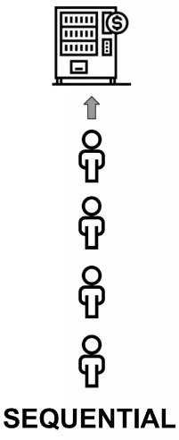
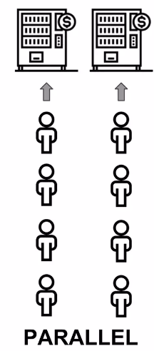
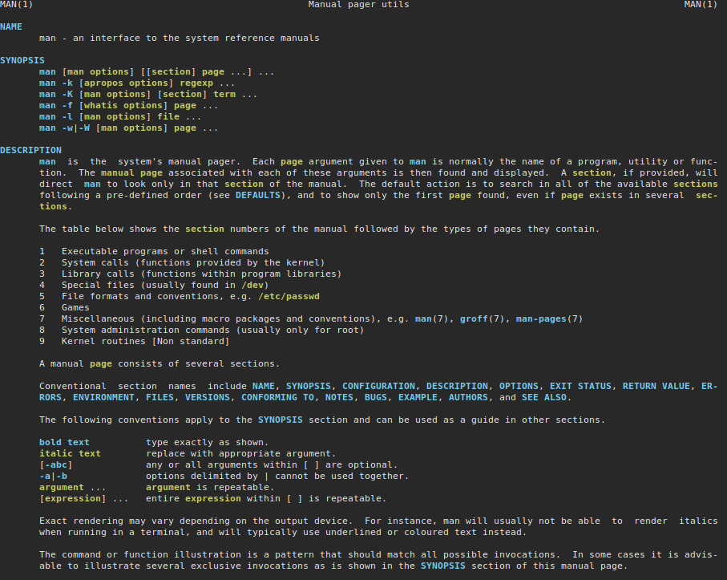
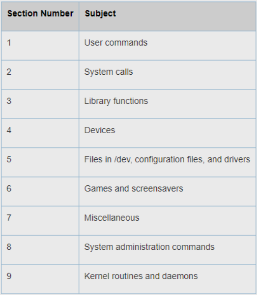

<!-- _footer: "[Download as a PDF](https://github.com/UniOfGreenwich/COMP1712-Lectures/raw/gh-pages/content/Documentation/Documentation.pdf)" -->

# Documentation and Man Pages

    Module Code: COMP1712

    Module Name: Computer Architectures and Operating Systems

    Credits: 15

    Module Leader: Seb Blair BEng(H) PGCAP MIET MIHEEM FHEA

---

## Why Documentation

- **You**
  - put down the project and return to it much later
  - want people to use it and give you credit
- **Others**
  - would be encouraged to contribute
  - more easily use your code
- **Science / Engineering**
  - Advances
  - Open collaboration
  - Reproducibility and transparency


---

## README.md

A brief description of the project
- Installation instructions
- A short example/tutorial
- Contributors
- Licenses
- Citations 
- Contacts


---

## Tools for Documentantion
- **Python**
  - Sphinx, Doctest, Numpydoc
- **R**
  - R Markdown, Kite
- **C++**
  - BoostBook, QuickBook, GhostDoc
- **Java**
  - Javadoc
- **Ruby**
  - Docurium
- **Doxygen**
  - r C, C#, PHP, Java, Python, and Fortran.

---

## Tools for Documentation for Bash

- `shdoc` (Shell Documentation)
  - converts comments written according to the API into markdown
  - Community project,[https://github.com/reconquest/shdoc](https://github.com/reconquest/shdoc)
  - `shdoc < somescript.sh > somescriptdoc.md`

- Plain Old Documentation (POD)
  - lightweight markup language written in `perl`
  - `perldoc -F somescript.sh -oman -d somescriptdoc.gz` 

---

## Divergence Dilemma

- bash scripts are documented in seperate manual files `man-pages`. 
- `man-pages` are standard and well established
- as with all documentation code develops faster and is released, thus creates a divergence, as in code <-> documentation become out of sync.



<!--
Typically source code and documentation are not written in parallel but sequentially. 

First the source code is developed and later some documentation is added. Whenever bugs in the source code must be fixed or additional features are added, very often the documentation is not updated. 

Hence the documentation is no longer describing the current version of the source code, but still reflects the initial version of the software program.
-->

---

## Literate Programming
-  a computer program is given as an explanation of how it works in a natural language, such as English, interspersed (embedded) with snippets of macros and traditional source code, from which compilable source code can be generated.


---

## `man-pages`

- system utility and allows you to read what a program, 
utility or function does, its arguments, outputs and general behaviour.




---

## `man-pages` Sections

- Each page is stored in a designated section -> 
  
- So where are Man pages stored?
  `/usr/share/man/man#/page.#.gz`



---

## `man-pages` Layout

<div style="font-size:17pt">

**NAME**
- The name of the command or function, followed by a one-line description of what it does.

**SYNOPSIS**
 - In the case of a command, a formal description of how to run it and what command line options it takes. 

**DESCRIPTION**
 - A textual description of the functioning of the command or function.

**EXAMPLES**
 - Some examples of common usage.

**SEE ALSO**
 - A list of related commands or functions.

Other sections may be present, but these are not well standardised across man pages. Common examples include: **OPTIONS**, **EXIT STATUS**, **RETURN VALUE**, **ENVIRONMENT**, **BUGS**, **FILES**, **AUTHOR**, **REPORTING BUGS**, **HISTORY** and **COPYRIGHT**.

</div>

---

## `man-pages` Syntax

```sh
.TH CORRUPT 1
.SH NAME
corrupt \- modify files by randomly changing bits
.SH SYNOPSIS
.B corrupt
[\fB\-n\fR \fIBITS\fR]
[\fB\-\-bits\fR \fIBITS\fR]
.IR file ...
.SH DESCRIPTION
.B corrupt
modifies files by toggling a randomly chosen bit.
.SH OPTIONS
.TP
.BR \-n ", " \-\-bits =\fIBITS\fR
Set the number of bits to modify.
Default is one bit
```

```sh
$ gzip < corrupt.1 > corrupt.1.gz 
$ man -l corrupt.1.gz 
```

