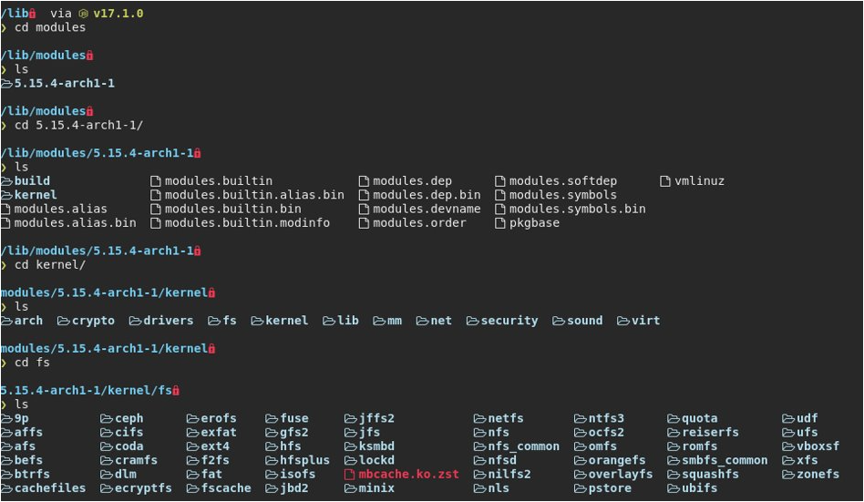
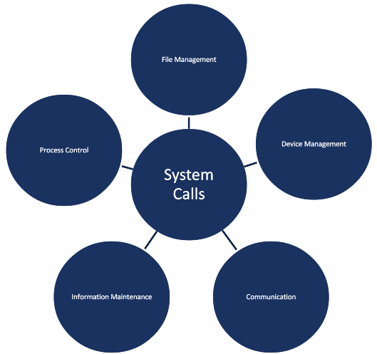
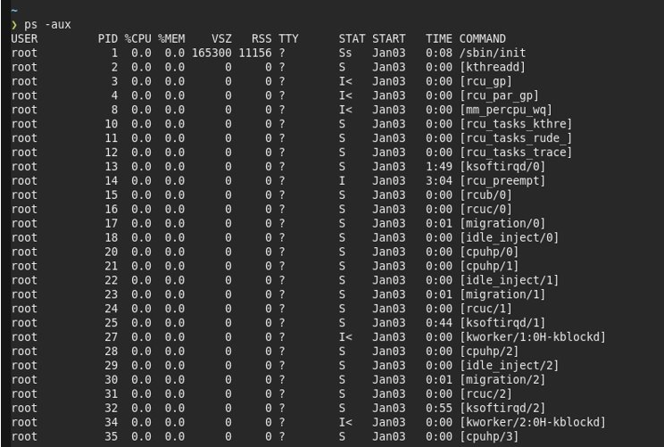
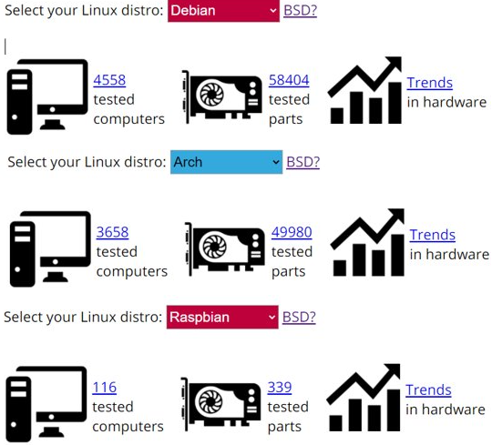
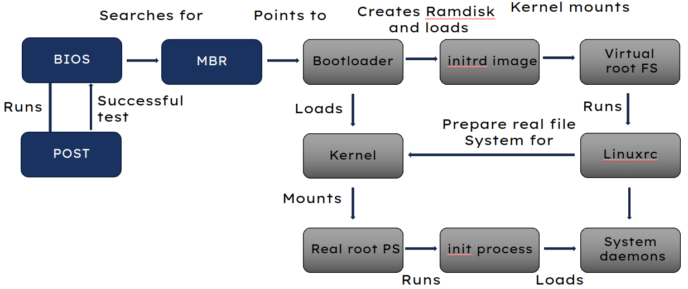
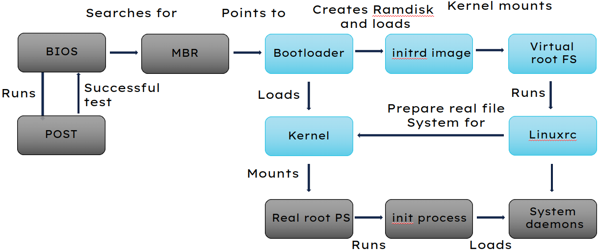
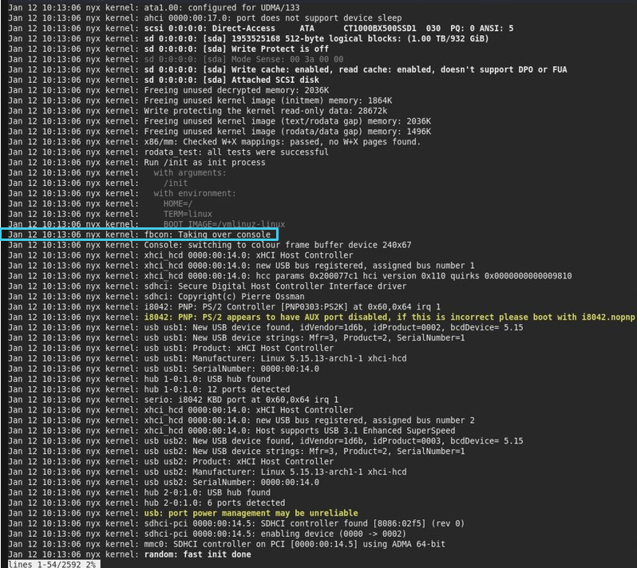
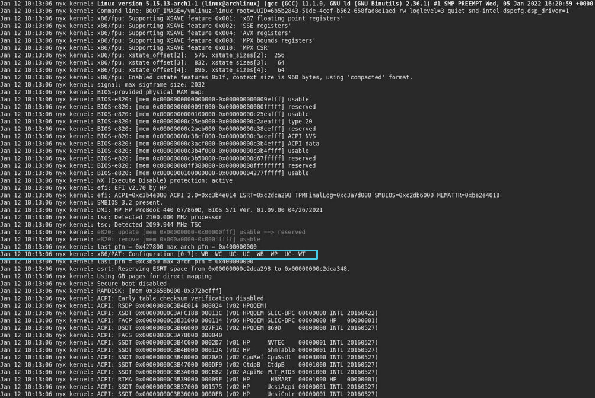
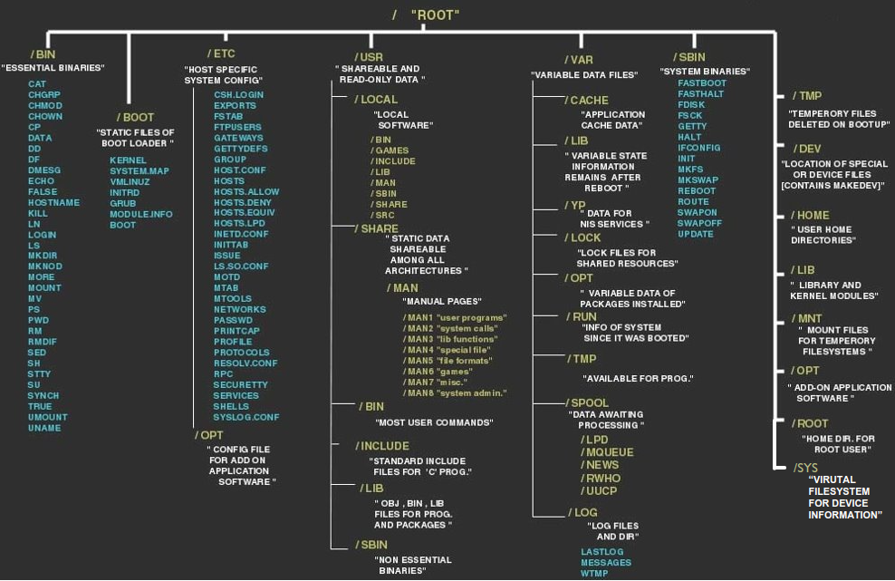

# Exploring Linux Based Operating Systems

    Module Code: COMP1712

    Module Name: Computer Architectures and Operating Systems

    Credits: 15

    Module Leader: Seb Blair BEng(H) PGCAP MIET MIHEEM FHEA
---

## Linux System: Diagrammatic View

---

## Linux A version of UNIX

Linux OSs have these primary components

 - Kernel
 - System Library
 - System Utility
 - User Application
 - Hardware Platform

---

## System Library 1

System libraries are special functions or programs using which application programs or system utilities accesses Kernel's features.​

**Examples of file extensions for libraries files:​**
 - *.a - These are statically linked libraries. Static libraries are linked into programs.​

 - *.bin - These libraries are binary files.​

 - *.fw - Firmware files are special libraries/drivers for hardware.​

 - *.o - Many loadable kernel modules/objects are object files.​

 - *.so - These files are dynamically-linked shared libraries that are not linked put into programs. Rather, programs reference this library and obtain functions/code from it.​

<!--
System libraries are special functions or programs using which application programs or system utilities accesses Kernel's features.​

These libraries implement most of the functionalities of the operating system and do not requires kernel module's code access rights​
-->
---

## System Library 2

`/lib/` - The important shared library files are kept in here. Mainly these are system libraries or low-level libraries. ​

The Linux kernel modules are kept under `/lib/modules/` and firmware drivers are under `/lib/firmware/`.​

<!--

The drivers/modules that are stored under here are the loadable kernel modules. ​

When modprobe inserts a module into the running kernel, modprobe is inserting modules that are under this directory. ​

The filesystem drivers are also under this directory. For instance, the FAT filesystem driver is /lib/modules/5.15.4-arch-1/kernel/fs/fat/msdos.o.​

-->

---
## System Library 3

- `/usr/lib/` - Program libraries are stored here. These libraries are either multiarch or specific to the current system​
 - `/usr/libexec/` - These are application-specific executable libraries.​
- `/usr/lib32/` - 32-bit specific application libraries are found here.​
- `/usr/lib64/` - 64-bit specific application libraries are found here.​
​

---

## System Library 4

Users can see a list of libraries needed by an executable by running the `"ldd"` command​

`cp` – uses dynamic libraries​

`brave` – uses static libraries that are built in to the executable ​

---

## System Utility 1

System Utility programs are responsible to do specialized, individual level tasks.​

The system utilities consist of various system interrupts and system calls which are to transfer the control for the user mode to the kernel mode containing the kernel and shell for further execution of the commands. ​

The control can be transferred using system calls.​

System call is an interface between a process and the operating system​

<!--
System libraries are special functions or programs using which application programs or system utilities accesses Kernel's features.​​

These libraries implement most of the functionalities of the operating system and do not requires kernel module's code access rights​
-->

---

## System Utility 2

File management system calls handle file manipulation jobs like creating a file, reading, and writing, etc. 

The Linux System calls under this are:​

`open()`: It is the system call to open a file.​

`read()`:​ This system call opens the file in reading mode. Multiple processes can execute the `read()` system call on the same file simultaneously.​

`write()`:​ This system call opens the file in writing mode. Multiple processes can not execute the `write()` system call on the same file simultaneously.​

`close()`: This system call closes the opened file.​

---

## System Utility 3

Device management does the job of device manipulation like reading from device buffers, writing into device buffers, etc. 

The Linux System calls under this is `ioctl()`.​

`ioctl()`: is referred to as Input and Output Control.​

It is a system call for device-specific input/output operations and other operations which cannot be expressed by regular system calls.​

---

## System Utility 4

Information Maintenance handles information and its transfer between the OS and the user program. In addition, OS keeps the information about all its processes and system calls are used to access this information.​

​`getpid()`: `getpid()` stands for Get the Process ID.​

The function shall return the process ID of the calling process..​

`alarm()`: This system call sets an alarm clock for the delivery of a signal that when it has to be reached. ​

`sleep()`: This System call suspends the execution of the currently running process for some interval of time.​
pdf
<!--
Getpid() always be successful and no return value is reserved to indicate an error.​

Alarm() It arranges for a signal to be delivered to the calling process.​

​Sleep() Meanwhile, during this interval, another process is given chance to execute. (USEFUL FOR SCHEDULING ALGORITHMS)​​
-->

---

## System Utility 5

These types of system calls are specially used for inter-process communications.​

 - **Message Passing**(processes exchange messages with one another) 

- **Shared memory** (processes share memory region to communicate)​

- `pipe()`: System call is used to communicate between different Linux processes.​

- `shmget()`: Stands for shared memory segment.​ It is mainly used for Shared memory communication.​

- `mmap()`: This function call is used to map or unmap files or devices into memory.​

<!--
The pipe() system function is used to open file descriptors.​​

Shmget() This system call is used to access the shared memory and access the messages in order to communicate with the process.​

The mmap() system call is responsible for mapping the content of the file to the virtual memory space of the process.​
​-->
--- 

## System Utility 6

Process Control system calls perform the task of process creation, process termination, etc.​

`fork()`: A new process is created by this system call.​ A new process may be created with `fork()` without a new program being run-the new sub-process simply continues to execute exactly the same program that the first (parent) process was running.​

`exit()`: system call is used by a program to terminate its execution.​

`exec()`:​ A new program will start executing after a call to `exec()​`. Running a new program does not require that a new process be created first. ​

<!--
Fork() It is one of the most widely used system calls under process management.​

Exit() The operating system reclaims resources that were used by the process after the exit() system call.​

Exec() Any process may call exec() at any time. The currently running program is immediately terminated, and the new program starts executing in the context of the existing process.​
-->

---

## System Utility 7

`ps` is a system utility program for snapshotting of the current processes.​
​
**ISO/IEC 9945-1:2000**​

> “Defines a standard operating system interface and environment, including a command interpreter (or "shell"), and common utility programs to support applications portability at the source code level.”​

---

## User Application

The application which user required to perform its task. example – office suites, VSCode, gcc, brave, etc​

---

## Hardware Platform

The resources of the system such as keyword, Monitor, Printer etc with which a user can input/output the request are supported by the Linux.​

[https://linux-hardware.org/​](https://linux-hardware.org/​)

---

## Boot Process

<!--
BIOS Stage​
Boot Loader Stage​
Kernel Stage
-->

---

## BIOS Stage

<!--
When the machine is powered on BIOS is the first one to be called to verify if the hardware is present in the machine and if it is functioning.​
​
After a successful test, BIOS checks the MBR (Master Boot Record) in the hard disk to check if it refers to the location of the boot loader.​

-->

---

## Bootloader Stage

<!--
The boot loader will present the user with a list of menu entries, each of which corresponds to different operating system​

The boot loader will then start to boot the operating system​

When you select the the option to start Linux, it decompresses the Linux kernel in memory​

After that Linux kernel (which you selected to boot from) loads initrd (Initial ramdisk)​

The initrd is used by the Linux kernel as a temporary filesystem in the memory​

It contains tools and kernel modules which will continue the boot process including mounting a virtual root file system temporarily.​

Instead of using initrd, some Linux filesystem will also use initramfs.​

It serves the same purpose of initrd, it is just that it is a successor of initrd​

linuxrc is an executable file that is next spawn, it probes the mass storage hardware and finds a suitable kernel module to drive the mass storage hardware​

This is required to prepare the real root filesystem to be mounted by the Linux kernel​
-->

---

## Kernel Stage

<!--
In the kernel stage of the Linux boot sequence, the Linux kernel based on the result of linuxrc can then mount the real root file system​

The real root file system in Linux is referenced as "/" and it is where all other sub directory and files visible when Linux is running exist​

The kernel will then spawn the init process, this process always has the process identifier (PID) as "1" because it is the first background process or daemon started by the kernel upon boot​

All other background daemons are spawned from the init process​

So the init process will load other system daemons depending upon the configuration of different runlevel​
-->

---

## Boot Process Log

<!--
The Framebuffer Console — The Linux Kernel documentation​ https://www.kernel.org/doc/html/latest/fb/fbcon.html

​What are the features of fbcon? The framebuffer console supports high resolutions,   ​
varying font types, ​
display rotation, p​
rimitive multihead, etc. ​
Theoretically, multi-colored fonts, ​
blending, ​
aliasing, and any feature made available by the underlying graphics card are also possible.​

-->

---

## Kernel Log

<!--
For example : ​

Memory type range registers ( MTRRs) are a set of processor supplementary capability control registers that provide system software with control of how they have access to memory ranges by the CPU are cached. ​
-->
---

## Systemmd Log

<!--
The “DESKTOP BUS” (dbus)  -> Out of Memory (OOM) killer is called by kernel to free some memory​
-->

---

## File System

---

Explore some of the files in the linux system to obtained useful for information about the system in the command line and then via a bash script.
