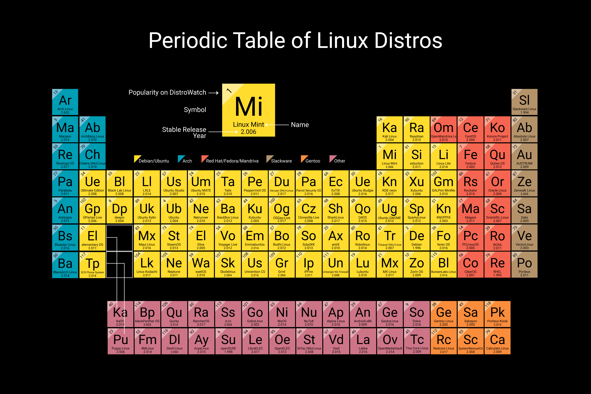
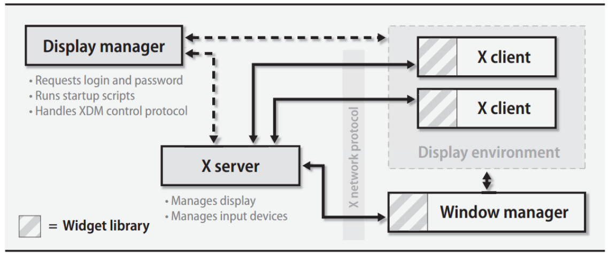
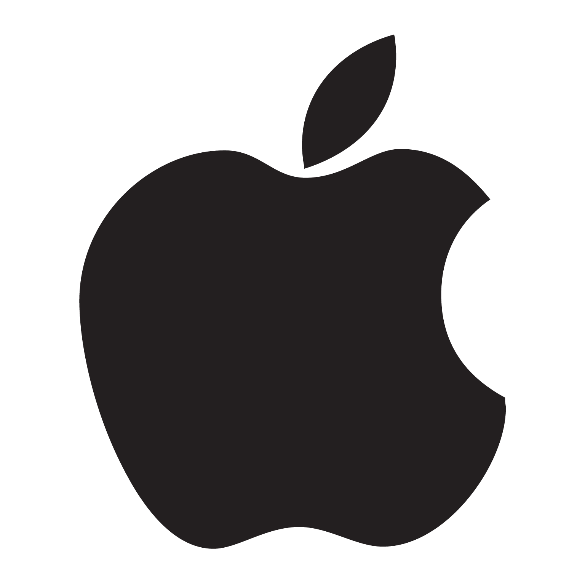

<!-- _footer: "[Download as a PDF](https://github.com/UniOfGreenwich/COMP1712-Lectures/raw/gh-pages/content/OSTypes/OSTypes.pdf)" -->

# Operating System Types

    Module Code: COMP1712

    Module Name: Computer Architectures and Operating Systems

    Credits: 15

    Module Leader: Seb Blair BEng(H) PGCAP MIET MIHEEM FHEA

---

## Types of OS

?

- Batch operating system.
- Embedded operating system.
- Distributed operating system.
- Multi-processing/tasking operating system.
- Network operating system.
- Real-time operating system.
- Time-sharing operating system.

---

## Batch OS

- **Batch** - because batch system is very useful for calculating the salaries of all employees in the end of month​

- **Bank Invoice System** - produce all monthly statements of all bank’s clients​
- **Transactions Process** - mostly implement the international money transfers system.​
- **Daily Report** - manufacturer industries, every day need operational statement for production line​

---

## Multi-tasking/Time-sharing Operaing Systems

Time-sharing operating system enables people located at a different terminal(shell) to use a single computer system at the same time. ​

The processor time (CPU) which is shared among multiple users is termed as time sharing.​

**Adv​​**
- It provides the advantage of quick response.​​
- This type of operating system avoids duplication of software.​​
- It reduces CPU idle time.​​

**DisAdv​​**
- Time sharing has problem of reliability.​​
- Question of security and integrity of user programs and data can be raised.​​
- Problem of data communication occurs.​

---

## Embedded OS

- Specialised operating system
- Perform a particular task for a given device that is not a computer
- Designed to be compact, efficient at how much the resources are used and most reliable.

---
## Real Time OS

A real time operating system time interval to process and respond to inputs is very small. Examples: Military Software Systems, Space Software Systems are the Real time OS example.​

**Soft Real Time OS​**

- A Soft RTOS is a system in which the deadline for certain tasks can be delayed to some extent. For example, if the task deadline is 1:20:30PM, then the task can on occasions complete at let us say 1:20:35PM every. However, it can not delay for too long say 1:30PM.​

**Hard Real Time OS​**

- A Hard RTOS is a system which meets the deadline for every process at all times. For example, if the task deadline is 1:20:30PM, then the task has to complete before 1:20:30PM every time.​

---

## RTOS 2

**VxWorks**: This OS is part of the Mars 2020 rover. ​

**QNX**:  it is compatible with platforms like ARM and x86. Industries using QNX are automotive, railway transportation and health-care.​

**eCos**: is an open-source real-time operating system.

**RTLinux**: is a hard RTOS. It runs the Linux operating system as a full preemptive process. As a result, it is useful in controlling robots, data acquisition systems, manufacturing plants.​

<!--
VX  Also, in the past, it was used in Phoneix Mars lander, Boeing 787, Honda Robot ASIMO etc.

eCOS Used for Chibis-M microsatellite‘s altitude and stabilization control system.
-->

---

## Distributed OS

- Distributed systems use many processors located in different machines to provide very fast computation to its users.​

- A DOS is a system which contains multiple components located on different machines, which coordinate and communicate actions in order to appear as a single coherent working system to the user.​

---

## Network OS

- Network Operating System runs on a server. It provides the capability to serve to manage data, user, groups, security, application, and other networking functions. ​

- Includes software and associated protocols to communicate with other autonomous computers via a network conveniently and cost-effectively​

- It allows devices like a disk, printers, etc., shared between computers. The individual machines that are part of the Network have their operating system.​

---

## Mobile OS

?

---

## OS - Market Share

​

---

## Linux Distros

---

## Window Managers

**Definition:**

- Control the placement and appearance of windows.
- Handle window decorations, title bars, and borders.
- Example:
    - Openbox, i3, Awesome WM.
- Key Characteristics:
  - Lightweight.
  - Confgurable.

---

## Login Managers

**Definition:**

- Manage user authentication at login.
- Present login screen for entering credentials.
- Example:
  - LightDM, GDM (GNOME Display Manager), SDDM.

- Key Characteristics:
  - User authentication.
  - Session selection.

---

## Display Managers

**Definition:**

- Control the display server connection.
- Facilitate user sessions.
- Example:
  - XDM (X Display Manager), X11.

- Key Characteristics:
  - Starting graphical sessions.
  - Communicates with X server.

--- 

## Desktop Environment

**Definition:**

- Integrated suite of applications and tools.
- Provides a cohesive user interface.
- Example:
  - GNOME, KDE, XFCE.

- Key Characteristics:
  - Includes file manager, settings, and applications.
  - Affects overall look and feel.

---

## Tiling Window Managers

**Definition:**

- Organise windows in a non-overlapping layout.
- Automatic window arrangement.
- Example:
  - i3, dwm, xmonad.

- Key Characteristics:
  - No manual window placement.
  - Efficient use of screen space.

--- 

## Windows:

**Windows Manager:**

- Primarily uses the Desktop Window Manager (DWM).
- Provides window composition, rendering, and management.

**Login Manager:**

- Controlled by the Windows Logon process.
- Manages user authentication during login.

**Display Manager:**

- Uses the Windows Display Driver Model (WDDM).
- Facilitates communication with graphics hardware.

**Desktop Environment:**

- Windows OS provides a comprehensive desktop environment.
- Includes the Windows Explorer shell.

---

## macOS:

**Windows Manager:**

- Managed by the Quartz Compositor.
- Handles window drawing and management.

**Login Manager:**

- Utilizes the macOS login window.
- Manages user authentication.

**Display Manager:**

- Core Graphics framework manages the display.
- Coordinates with hardware via Metal.

**Desktop Environment:**

- macOS includes the Aqua graphical user interface.
- Provides a cohesive user experience.

